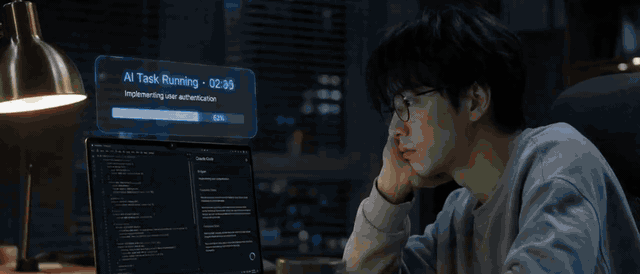
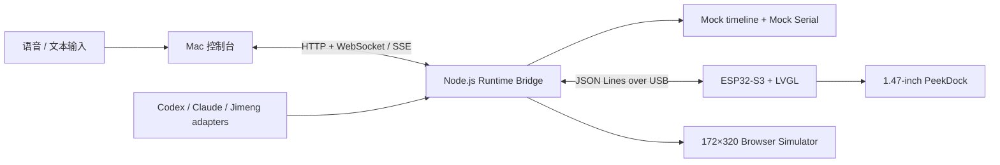

# PeekDock

**把 AI 的等待，交给桌面伙伴。** PeekDock 是一个 AI 协作外设：它把多个 Agent 的异步任务统一呈现在 172×320 小屏上，并支持语音派活、快速发送、Agent 切换与状态提醒。

## 1 分钟视频了解产品

[](docs/demo/peekdock-demo.mp4)

**[▶ 点击打开带声音的高清 MP4 完整视频](docs/demo/peekdock-demo.mp4)** · 约 71 秒 · 1280 × 548

## Demo 实机画面


> 图片版本是比赛 Demo MVP，使用串口通信。

## 为什么做 PeekDock

Codex、Claude、即梦和 Browser Agent 可以同时工作，但它们的运行、等待确认、失败和完成散落在不同窗口。人必须反复切屏巡检，既打断主任务，也容易漏掉卡点。

PeekDock 把这种“等待管理”从主屏剥离出来：主屏继续创作，小屏以拟人化角色告诉你谁在工作、谁需要输入、谁已经交付。它不是用来阅读长内容的副屏，而是一块低打扰的 AI 团队状态面板。

## Demo 已实现

- 四个固定 Agent：Codex、Claude、Jimeng、Browser Agent，复用仓库内像素角色素材。
- 统一状态：`idle`、`running`、`needs_input`、`completed`、`failed`。
- 语音发送：浏览器 Web Speech API 录音与中文转写，含录音/转写/权限失败状态；不支持或未授权时直接使用文本输入。
- 任务派发：选择 Agent、选择完成/需确认/失败场景并发送；mock timeline 自动推进任务。
- 完成提醒：任务完成后显示“老板，我做好啦”、Toast、角色完成态和 100% 进度。
- Mac 控制台：AI 团队列表、任务队列、WebSocket 事件流、mock serial/USB 状态与一键演示。
- 小屏 simulator：按真实 172×320 画布展示角色、状态、阶段和进度；支持按钮、键盘方向键、点击与横向滑动切换 Agent。
- Runtime Bridge：HTTP API、WebSocket、SSE、Agent 状态归一、任务队列、mock serial，以及可选的真实 Codex/Claude/即梦只读监控。
- ESP32/LVGL：四页 Agent 缓存、横向切换、状态动画、Browser 角色素材、USB Serial JSON Lines 协议。

本版本已明确砍掉游戏；旧“上滑跨设备游戏/跳转”不属于当前产品。上滑仅可作为固件本地角色隐藏手势，任务发起入口已经由语音/文本发送替代。

## 快速开始

要求：macOS 或 Linux、Node.js 20+、npm。

```bash
git clone https://github.com/hiko111/peekdock.git
cd peekdock
npm install
npm start
```

打开 <http://127.0.0.1:4173>。也可以使用可移植启动脚本：

```bash
./scripts/start-peekdock.sh
```

指定端口或开启真实 Agent 监控：

```bash
PORT=4178 ./scripts/start-peekdock.sh
PEEKDOCK_REAL_MONITORS=1 ./scripts/start-peekdock.sh
```

默认关闭真实监控，保证比赛现场演示稳定；默认找不到串口时自动进入 `mock-serial`，不影响 simulator。

## 3 分钟 Demo 操作

1. 启动控制台，确认顶部显示 `WEBSOCKET LIVE` 和 `MOCK SERIAL`，小屏为 Codex `Idle`。
2. Agent 选择 Codex，按住“按下说话”讲一句任务；若浏览器不允许麦克风，直接在文本框输入。
3. 场景选择“自动完成”，点击“发送任务”。观察小屏从 `Working`、阶段进度流转到 `Done`。
4. 完成时展示“老板，我做好啦”和完成提醒。
5. 点击 Claude / Jimeng / Browser Agent，或在小屏左右滑动，查看各自角色与状态。
6. 点击“一键演示”，同时得到 Codex 工作中、Claude 需确认、Jimeng 已完成、Browser 调研中四种评审状态。

更稳妥的现场话术和故障降级见 [Demo 指南](docs/DEMO_GUIDE.md)。

## 技术架构



Runtime Bridge 是唯一权威状态源。控制台和 simulator 使用 WebSocket，断开时回退 SSE；物理小屏使用 USB Serial/JTAG。四端消费同一个任务模型，硬件断开不会改变 Demo 行为。详细设计见 [技术架构](docs/ARCHITECTURE.md) 与 [协议说明](protocol/README.md)。

## API 与状态

常用接口：

- `GET /api/state`：完整公开状态。
- `POST /api/send-task`：`{ agent, prompt, scenario }`，其中场景为 `done`、`input_required` 或 `error`。
- `POST /api/task-status`：手动切换某 Agent 状态，用于 Demo 编排。
- `POST /api/demo/reset`：恢复四 Agent idle。
- `POST /api/demo/seed`：生成比赛演示状态。
- `GET /events`：SSE；`WS /ws`：实时状态与事件。

## 硬件与 Simulator

目标硬件为 Waveshare ESP32-S3-Touch-LCD-1.47（ESP32-S3R8、16MB Flash、8MB PSRAM、JD9853 172×320 屏、AXS5106L 触摸）。

无硬件：直接运行网页，顶部显示 `MOCK SERIAL`，所有验收流程可完成。

有硬件：安装 ESP-IDF 5.2+ 后：

```bash
idf.py set-target esp32s3
idf.py build
idf.py -p /dev/cu.usbmodem1301 flash monitor
PEEKDOCK_SERIAL_PORT=/dev/cu.usbmodem1301 npm start
```

串口协议是一行一个 JSON 对象；设备重连时 Bridge 发送 `task_snapshot` 恢复四个 Agent。板卡、GPIO 和固件说明见 [硬件说明](PROJECT_CONTEXT.md)。

## 与常见方案的区别

| 方案 | 主要用途 | PeekDock 的区别 |
| --- | --- | --- |
| 手机 / 手表 | 通用通知和信息消费 | PeekDock 常驻工位、无解锁/抬腕成本，只展示 AI 团队状态与下一步动作 |
| 普通副屏 | 扩展桌面、承载窗口 | PeekDock 不复制窗口；它归一状态、拟人化表达并主动突出卡点 |
| Stream Deck | 手动触发快捷操作 | PeekDock 首先是异步状态输出设备，同时保留轻量输入与 Agent 切换 |
| 软件桌宠 | 情绪陪伴 | PeekDock 角色由真实任务状态驱动，并可延伸到实体硬件和企业适配层 |

## 比赛 QA

**为什么不是手机或手表？** 手机通知会与大量生活信息竞争，手表需要抬腕且展示空间有限。PeekDock 常驻视线边缘，是单一目的的 AI 状态环境显示，不抢占主屏，也不要求解锁。

**为什么不是副屏？** 副屏只是增加像素，仍要求用户理解每个工具界面。PeekDock 在 Runtime Bridge 层先把不同 AI 的事件归一成五种状态，再用角色、颜色和动作降低识别成本。

**为什么不是 Stream Deck？** Stream Deck 以“人按键触发”为中心；PeekDock 以“Agent 异步工作、设备主动汇报”为中心。语音派活和轻量快操是输入，持续状态与提醒才是核心。

**AI 数据如何接入？** MVP 支持确定性的 mock adapter，同时保留 Codex session JSONL、Claude project JSONL 和即梦浏览器页面的只读 adapter。商业化版本可通过厂商 API、hooks、MCP 或本地日志适配器接入，统一输出 PeekDock Task Schema。

**通信协议是什么？** Mac 内部使用 HTTP + WebSocket/SSE；Mac 与 ESP32 使用 USB Serial/JTAG 上的 JSON Lines。`task_snapshot` 做全量恢复，`task_update` 做增量状态，`action_event` 把硬件输入交回 Mac 白名单执行。

**支持多少 Agent？** 当前演示固定四页，协议与 Runtime Bridge 可以扩展更多 Agent；实体 172×320 小屏以 4–8 个高频 Agent 最合适，更多任务由 Mac 控制台管理和筛选。

**最终产品形态是什么？** 一个带 1–2 英寸低功耗屏、麦克风/触摸或旋钮的桌面硬件，配套 Mac/Windows Runtime；既可独立售卖，也可作为 OEM 模组进入键盘、显示器底座或桌面终端。

**厂商自研硬件后，PeekDock 的优势还在吗？** 护城河不只在屏幕，而在跨工具任务状态标准、Agent 角色资产、适配器生态、任务优先级与提醒体验。厂商硬件可以成为 PeekDock Runtime 的新载体，反而扩大分发。

## 测试

```bash
npm run check
npm test
```

测试覆盖静态控制台、四 Agent 初始化、一键演示、任务 `running → needs_input → completed` 和 WebSocket 初始状态。

## 仓库地图

```text
runtime-bridge/server.mjs    Node.js 状态桥与 API
runtime-bridge/public/       Mac 控制台与小屏 simulator
src/                         ESP-IDF / LVGL 固件
assets/raw|processed|lvgl/   角色素材
protocol/                    JSON Lines 协议与 fixtures
demo-results/                mock 交付物
docs/                        架构、演示指南和截图
tests/                       Runtime Bridge 集成测试
```

## 未来规划

1. 用官方 API/hooks 替换启发式 Agent adapters，并增加状态置信度与断线恢复。
2. 加入设备端麦克风、按键/旋钮和本地唤醒词，让语音派活不依赖浏览器。
3. 支持自定义角色、团队 Agent 映射、任务优先级和安静时段。
4. 做 Windows Runtime、Wi-Fi/BLE 传输和可拆卸随身模式。
5. 沉淀开放 Task Schema 与硬件 SDK，让更多 AI 工具和 OEM 设备接入。

## 当前限制

- 浏览器语音识别依赖 Chromium/Safari 的 Web Speech 实现和麦克风权限；文本输入永远可用。
- 当前环境未连接目标 ESP32，因此本轮以 simulator、协议与源码检查完成验收；历史仓库已有该板卡成功 build/flash 记录。
- 真实 Agent 监控是可选实验适配器，比赛默认用 mock timeline，避免网络、登录态或本地会话变化影响演示。

许可证见 [LICENSE](LICENSE)。
