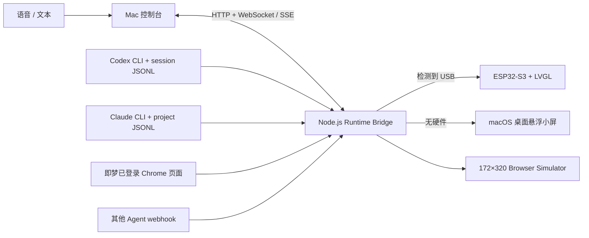

# PeekDock

**把 AI 的等待，交给桌面伙伴。** PeekDock 把 Codex、Claude Code、即梦与其他 Agent 的真实异步任务状态统一显示在 ESP32 小屏；没有硬件时，同一块小屏会自动变成 macOS 桌面悬浮伙伴。

## 1 分钟视频了解产品

[](docs/demo/peekdock-demo.mp4)

**[▶ 点击打开带声音的高清 MP4 完整视频](docs/demo/peekdock-demo.mp4)** · 约 71 秒 · 1280 × 548

## Demo 实机画面


> 图片为路演实体串口mvp版本
## 为什么做 PeekDock

Codex、Claude、即梦和 Browser Agent 可以同时工作，但运行、等待确认、失败和完成散落在不同窗口。人必须反复切屏巡检，既打断主任务，也容易漏掉卡点。

PeekDock 把这种“等待管理”从主屏剥离出来：主屏继续创作，小屏用拟人化角色告诉你谁在工作、谁需要输入、谁已经交付。它不是阅读长内容的副屏，而是一块由真实 AI 事件驱动的低打扰团队状态面板。

## 已实现

- **真实数据默认开启**：自动读取 Codex session JSONL、Claude Code project JSONL、即梦 Chrome 页面状态；通用 Agent 可通过 webhook 接入。
- **真实任务派发**：Codex 使用本机 `codex exec --json`；Claude 使用 `claude -p`；即梦在已登录的 Chrome 页面填入提示词并触发生成。
- **双显示形态**：启动时自动发现 ESP32 串口；有设备就发送 USB JSON Lines，没有设备就运行原生 macOS 悬浮小屏。
- **四个 Agent 角色**：Codex、Claude、Jimeng、Browser Agent，统一为 `idle / running / needs_input / completed / failed`。
- **语音发送**：控制台通过 Web Speech API 转写；不支持或未授权时可直接输入文本。
- **实时控制台**：任务队列、适配器健康状态、WebSocket/SSE 事件流、设备状态和 172×320 simulator。
- **完成提醒**：角色完成态、声音提醒与 100% 进度。
- **ESP32/LVGL**：四页 Agent 缓存、横向切换、状态动画、USB Serial JSON Lines 与断线快照恢复。

Mock 只保留给离线演示和自动化测试，不是默认运行模式。本版本已砍掉游戏；旧“上滑跨设备游戏/跳转”已由语音或文本派发任务替代。

## 快速开始

要求：macOS、Node.js 20+、npm。无硬件模式的原生悬浮窗需要 Xcode Command Line Tools；如果没有 Swift 编译器，会自动降级到浏览器 simulator。

```bash
git clone -b codex/peekdock-demo-mvp https://github.com/1491720837-prog/peekdock.git
cd peekdock
npm install
npm run doctor
npm start
```

控制台地址：<http://127.0.0.1:4173>。

`npm start` 的默认行为：

1. 自动检查 `/dev/cu.usbmodem*`、`usbserial*` 和 `wchusbserial*`。
2. 找到 ESP32：把真实 Agent 状态发送到硬件小屏。
3. 没找到硬件：启动始终置顶、可拖动、可点击切换 Agent 的桌面悬浮小屏。
4. 同时启动 Runtime Bridge，并持续发现后续热插拔的设备。

需要确定性的离线演示时才使用：

```bash
npm run demo
```

## 首次连接真实 AI

### Codex

安装并登录 Codex CLI，确保 `codex` 命令可用。PeekDock 会读取 `~/.codex/sessions` 的真实状态，并通过 `codex exec --json` 派发控制台里的任务。

```bash
codex --version
npm run doctor
```

### Claude Code

安装并登录 Claude Code，确保 `claude` 命令可用。PeekDock 会读取 `~/.claude/projects`，并使用 `claude -p` 派发任务。没有安装时会明确显示 `missing`，不会生成假状态。

### 即梦 Jimeng

1. 使用 Google Chrome 打开 <https://jimeng.jianying.com/> 并登录。
2. 在 Chrome 菜单开启“查看 → 开发者 → 允许来自 Apple 事件的 JavaScript”。
3. 在控制台选择 Jimeng 并发送语音或文字；PeekDock 会填入提示词、触发生成并读取页面/API 状态。

即梦没有稳定公开的桌面任务 API，因此这一适配器依赖已登录页面。页面结构变化、验证码或登录失效时会进入 `needs_input`，要求用户接管，而不是伪造完成。

### Browser Agent / 其他 Agent

任何本地 Agent、MCP host 或自动化程序都可向本地 Bridge 上报真实事件：

```bash
curl -X POST http://127.0.0.1:4173/api/ingest \
  -H 'content-type: application/json' \
  -d '{
    "agent":"browser",
    "taskId":"research-42",
    "title":"调研 AI 外设竞品",
    "status":"running",
    "statusText":"正在读取真实来源",
    "progress":48
  }'
```

## Demo 操作

1. 运行 `npm run doctor`，确认需要展示的 Agent 为可用或已登录。
2. 运行 `npm start`；无硬件时观察桌面右上角悬浮小屏，有硬件时观察实体屏。
3. 打开控制台，选择 Codex，语音说出任务或输入文字并发送。
4. 观察 Codex 从 `Working` 进入真实工具阶段，并最终变为 `Done` 或 `Input required`。
5. 完成时展示完成态。
6. 点击悬浮屏左/右半边、控制台 Agent 卡片或实体屏手势，切换 Claude、Jimeng、Browser Agent。

现场演示建议与降级方案见 [Demo 指南](docs/DEMO_GUIDE.md)。

## 技术架构



Runtime Bridge 是唯一权威状态源。硬件、悬浮窗、网页 simulator 消费同一个任务模型；显示载体变化不会把真实数据切成 Mock。详细设计见 [技术架构](docs/ARCHITECTURE.md)、[协议说明](protocol/README.md) 与 [硬件说明](docs/HARDWARE.md)。

## API

- `GET /api/state`：状态、显示目标、串口和所有 adapter 健康信息。
- `POST /api/send-task`：`{ agent, prompt }`；真实模式下派发给对应客户端。
- `POST /api/ingest`：其他真实 Agent 上报标准化事件。
- `POST /api/switch-agent`：切换当前角色。
- `GET /events`：SSE；`WS /ws`：实时状态与事件。
- `/api/demo/*` 与 `scenario`：仅供显式 `npm run demo` 使用。

## 硬件

目标硬件为 Waveshare ESP32-S3-Touch-LCD-1.47（ESP32-S3R8、16MB Flash、8MB PSRAM、JD9853 172×320、AXS5106L 触摸）。

有硬件时：

```bash
idf.py set-target esp32s3
idf.py build
idf.py -p /dev/cu.usbmodem1301 flash monitor
PEEKDOCK_SERIAL_PORT=/dev/cu.usbmodem1301 npm start
```

## 与常见方案的区别

| 方案 | 主要用途 | PeekDock 的区别 |
| --- | --- | --- |
| 手机 / 手表 | 通用通知与信息消费 | 常驻工位、无需解锁/抬腕，只展示 AI 团队状态与下一步动作 |
| 普通副屏 | 扩展桌面、承载窗口 | 不复制窗口；先归一真实 Agent 状态，再拟人化表达卡点 |
| Stream Deck | 人按键触发快捷操作 | 以 Agent 异步工作、设备主动汇报为中心，输入只是辅助 |
| 软件桌宠 | 情绪陪伴 | 角色由真实任务事件驱动，并能无缝切到实体硬件 |

## 比赛 QA

**为什么不是手机或手表？** 通用通知会和生活信息竞争；PeekDock 是常驻视线边缘、单一目的的 AI 状态环境显示，不抢占主屏。

**为什么不是 Stream Deck？** Stream Deck 以“人按键触发”为中心；PeekDock 以“Agent 异步工作、设备主动汇报”为中心。

**AI 数据如何接入？** 当前使用真实 CLI 事件、本地 session JSONL、已登录网页状态与通用 webhook，统一输出 PeekDock Task Schema。Mock 只在显式 Demo 模式启用。

**通信协议是什么？** Mac 内部使用 HTTP + WebSocket/SSE；Mac 与 ESP32 使用 USB Serial/JTAG 上的 JSON Lines。`task_snapshot` 全量恢复，`task_update` 增量更新，`action_event` 把设备输入交回 Mac。

**支持多少 Agent？** 当前 UI 固定四个角色；协议和 webhook 可扩展。实体 172×320 屏以 4–8 个高频 Agent 最合适，更多任务由控制台筛选。

## 测试

```bash
npm run check
npm run overlay:build
npm test
```

自动化覆盖 Demo 模式、真实桌面模式、通用 Agent 事件接入、四 Agent 状态、WebSocket 与任务流转。真实账号授权和 ESP32 flash 必须在对应设备/账号环境中做最终验收。

## 仓库地图

```text
runtime-bridge/server.mjs    真实 Agent adapters、状态桥与 API
runtime-bridge/public/       Mac 控制台与浏览器 simulator
desktop-overlay/             无硬件时的原生 macOS 悬浮小屏
scripts/                     自动启动与环境自检
src/                         ESP-IDF / LVGL 固件
assets/raw|processed|lvgl/   角色素材
protocol/                    JSON Lines 协议与 fixtures
docs/                        架构、硬件、演示指南和视频
tests/                       Demo 与真实模式集成测试
```

## 当前限制与未来规划

- 语音识别依赖浏览器 Web Speech 与麦克风权限，文本输入始终可用。
- Claude Code 必须由使用者自行安装和登录；即梦必须由使用者完成登录/验证码及 Chrome 页面授权。
- 即梦网页 DOM 可能变化，后续优先替换为官方 API 或稳定扩展协议。
- 当前交付环境没有目标 ESP32，固件源码与协议已保留，但最终 build/flash、屏幕校色和触摸验收需要实物。
- 后续计划加入 Windows Runtime、Wi-Fi/BLE、官方 hooks/MCP adapter、可配置 Agent 与设备端麦克风。

许可证见 [LICENSE](LICENSE)。
